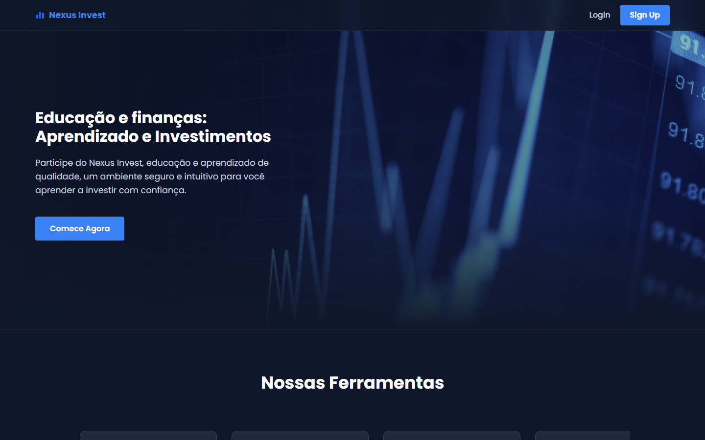
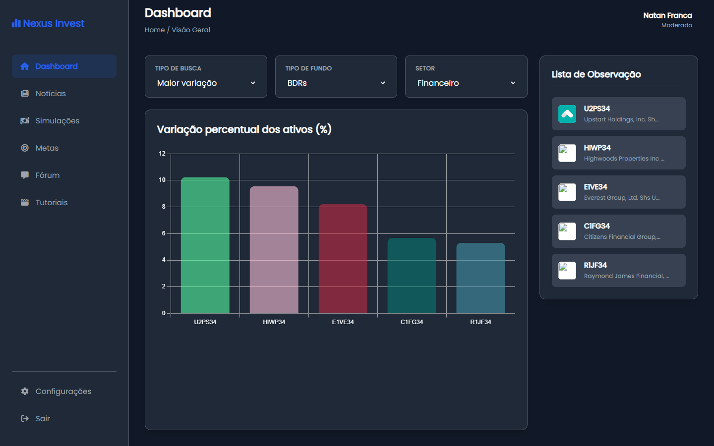
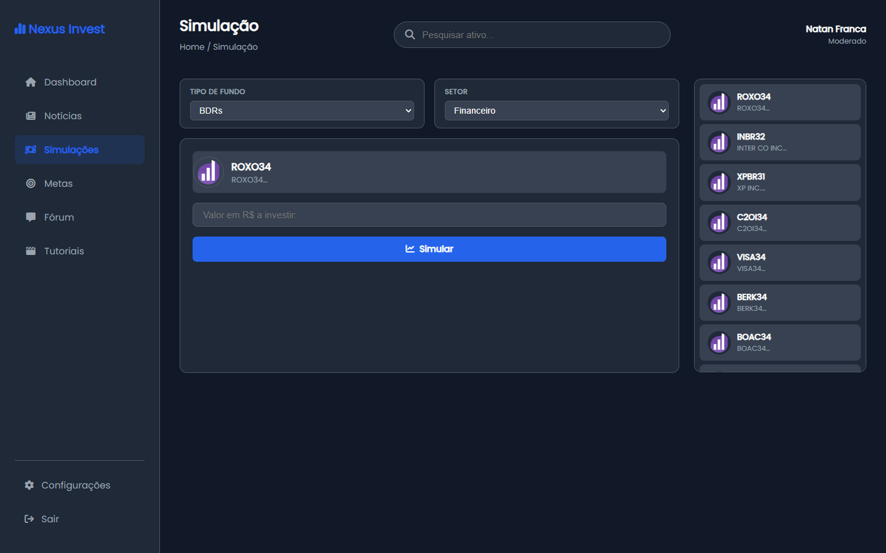
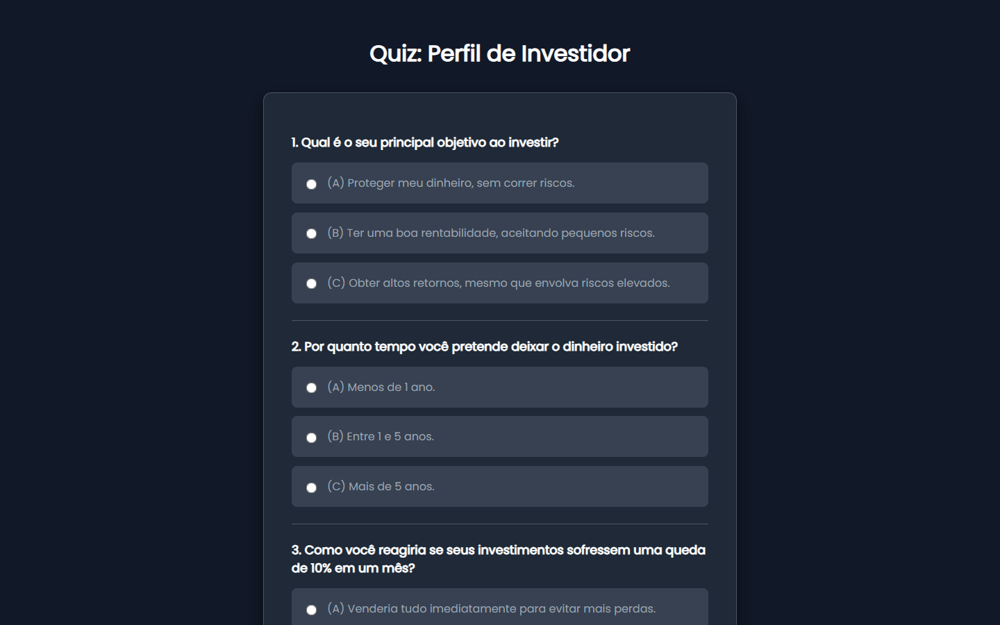
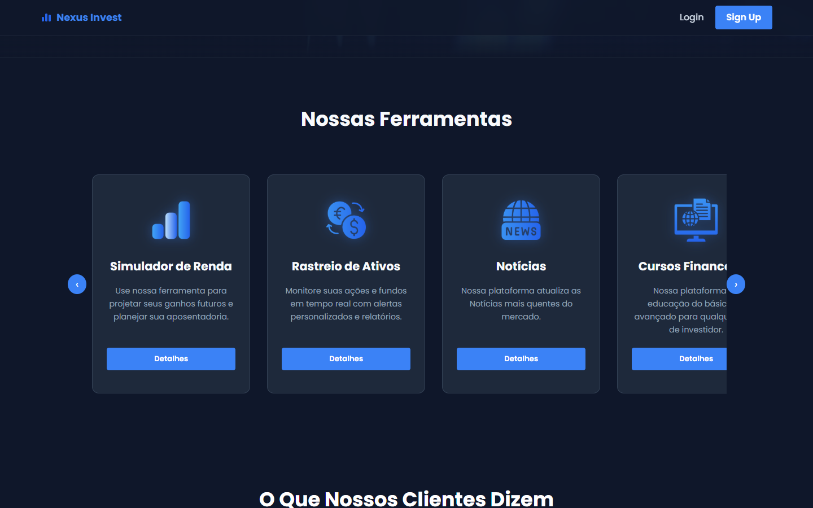
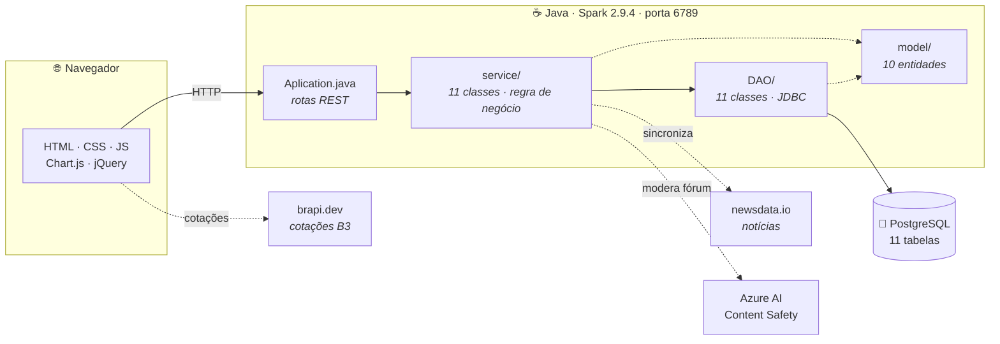
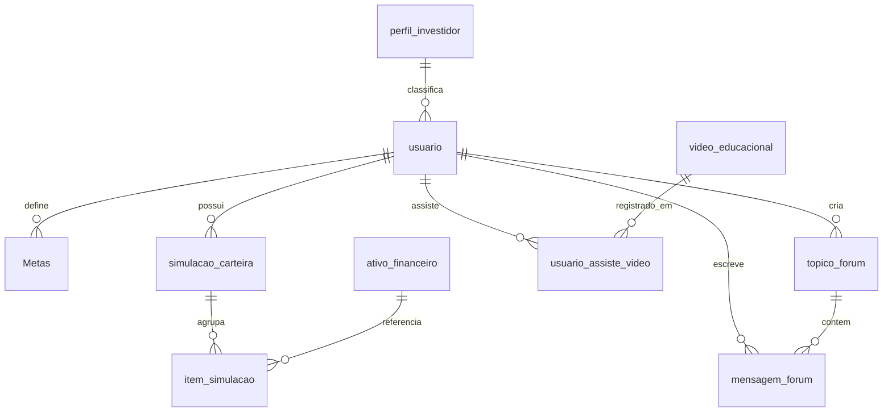

<div align="center">



# Nexus Invest

**Uma plataforma web de educação financeira para quem está começando a investir.**

Conteúdo educacional, simulador de carteira, cotações da B3 em tempo real,
metas, fórum moderado e um quiz que define o perfil de investidor — tudo em um só lugar.

[](https://openjdk.org/)
[](https://sparkjava.com/)
[](https://www.postgresql.org/)
[](https://maven.apache.org/)
[](LICENSE)

**Trabalho Interdisciplinar II — Ciência da Computação**
Pontifícia Universidade Católica de Minas Gerais · Campus Coração Eucarístico · 2026/1

</div>

---

## O problema

Quem nunca investiu esbarra sempre nos mesmos obstáculos: linguagem cheia de jargão,
medo de errar com dinheiro real e informação espalhada por dezenas de fontes.

O **Nexus Invest** ataca esses três pontos de uma vez. O usuário aprende com trilhas de
vídeo organizadas por tema, pratica em um simulador que usa cotações reais da B3 — sem
arriscar um centavo —, acompanha o mercado por um dashboard com dados ao vivo e tira
dúvidas em um fórum com moderação automática de conteúdo.

## Funcionalidades

| | Módulo | O que faz |
|:--:|---|---|
| 📊 | **Dashboard de mercado** | Gráficos de variação, volume e fechamento dos ativos, filtráveis por setor e tipo de fundo. Dados ao vivo da [brapi.dev](https://brapi.dev). |
| 🧮 | **Simulador de carteira** | Carteira fictícia com saldo, compra e venda de ativos a preço real de mercado. Permite errar sem custo. |
| 🎯 | **Metas financeiras** | Objetivos com valor-alvo, prazo e aportes parciais, acompanhando o progresso até a conclusão. |
| 🎓 | **Trilhas educacionais** | Mais de 60 vídeos catalogados por categoria, com marcação de progresso por usuário. |
| 📰 | **Notícias do mercado** | Sincronização automática de notícias financeiras via [newsdata.io](https://newsdata.io). |
| 💬 | **Fórum da comunidade** | Tópicos e mensagens entre usuários, com moderação automática por **Azure AI Content Safety**. |
| 🧭 | **Quiz de perfil** | Questionário que classifica o investidor como Conservador, Moderado ou Arrojado. |
| 🔐 | **Contas de usuário** | Cadastro, autenticação e gestão de perfil e preferências. |

## Telas

<table>
<tr>
<td width="50%"><br><sub><b>Dashboard</b> — variação dos ativos e lista de observação, com dados ao vivo da B3.</sub></td>
<td width="50%"><br><sub><b>Simulador</b> — busca de ativos e projeção de investimento a preço real.</sub></td>
</tr>
<tr>
<td width="50%"><br><sub><b>Quiz de perfil</b> — define o perfil de risco e o grava no cadastro.</sub></td>
<td width="50%"><br><sub><b>Página inicial</b> — carrossel com as ferramentas da plataforma.</sub></td>
</tr>
</table>

## Arquitetura

Aplicação Java em três camadas, servida por um servidor HTTP embarcado (Spark/Jetty),
com front-end estático consumindo as rotas REST.



**Organização do código** — `Codigo/src/main/`

```
java/
├── app/         Aplication.java (rotas) · Config.java (segredos fora do código)
├── model/       Usuario · AtivoFinanceiro · SimulacaoCarteira · Metas · TopicoForum · ...
├── DAO/         Acesso a dados via JDBC, uma classe por entidade
└── service/     Regra de negócio e resposta HTTP, uma classe por módulo

resources/public/   12 páginas HTML · 10 scripts · 5 folhas de estilo
```

<sub>3.900 linhas de Java · 1.400 linhas de JavaScript · 34 classes</sub>

## Modelo de dados



Os diagramas completos (Peter Chen, pé-de-galinha e esquema relacional) estão em
[`Documentacao/`](Documentacao/). O DDL e as cargas iniciais estão em
[`Codigo/README.md`](Codigo/README.md).

## Tecnologias

| Camada | Stack |
|---|---|
| **Back-end** | Java 17 · [Spark Java 2.9.4](https://sparkjava.com/) (Jetty embarcado) · Gson 2.10.1 · SLF4J |
| **Banco** | PostgreSQL · driver JDBC 42.2.16 |
| **Front-end** | HTML5 · CSS3 · JavaScript · [Chart.js](https://www.chartjs.org/) · jQuery |
| **APIs externas** | [brapi.dev](https://brapi.dev) (cotações B3) · [newsdata.io](https://newsdata.io) (notícias) · [Azure AI Content Safety](https://azure.microsoft.com/products/ai-services/ai-content-safety) (moderação) |
| **Build** | Maven |

## Como executar

### Pré-requisitos

- [JDK 17+](https://adoptium.net/)
- [PostgreSQL](https://www.postgresql.org/download/)
- [Maven](https://maven.apache.org/) — ou Eclipse com o plugin m2e

### 1. Clonar e criar o banco

```bash
git clone https://github.com/Nt-0411/nexusinvest-ti2-pucminas.git
cd nexusinvest-ti2-pucminas
createdb nexus
```

Execute, na ordem, todo o SQL de [`Codigo/README.md`](Codigo/README.md) no banco `nexus`.
Ele cria as 11 tabelas, as chaves estrangeiras e popula os vídeos e os perfis de investidor.

### 2. Configurar as credenciais

Nenhuma senha ou chave de API fica no código-fonte. Copie o arquivo de exemplo e preencha:

```bash
cd Codigo
cp .env.example .env
```

```ini
NEXUS_DB_USER=postgres
NEXUS_DB_PASSWORD=sua_senha
NEXUS_BRAPI_TOKEN=seu_token_brapi     # gratuito em https://brapi.dev
```

Só as três variáveis de banco são obrigatórias. Sem o token da brapi o dashboard e o
simulador ficam sem cotações; sem `NEXUS_NEWSDATA_API_KEY` as notícias não sincronizam;
sem as variáveis da Azure a moderação do fórum fica desligada. O restante da aplicação
funciona normalmente. Os mesmos nomes também são lidos como variáveis de ambiente do
sistema ou como `-D` na JVM.

### 3. Rodar

**Pelo Eclipse** — `Import → Existing Maven Projects` apontando para `Codigo/`, depois
executar [`Aplication.java`](Codigo/src/main/java/app/Aplication.java) como *Java Application*.

**Pela linha de comando**, a partir de `Codigo/`:

```bash
mvn compile exec:java
```

Acesse **http://localhost:6789**.

## Estrutura do repositório

| Pasta | Conteúdo |
|---|---|
| [`Codigo/`](Codigo/) | Código-fonte da aplicação e o DDL do banco |
| [`Documentacao/`](Documentacao/) | Diagramas de entidade-relacionamento e esquema |
| [`Divulgacao/`](Divulgacao/) | Apresentações das três sprints, vídeo de demonstração e capturas de tela |
| [`Artefatos/`](Artefatos/) | Artefatos de processo do projeto |

## Equipe

Projeto desenvolvido ao longo de três sprints por estudantes de Ciência da Computação
da PUC Minas — Campus Coração Eucarístico.

| Integrante |
|---|
| Italo Paula Gomides |
| Kaio Ferreira Dias |
| **Natan Franca Santa Rita** |
| Saulo Sena Fernandes Cunha |

**Professores orientadores:** Daniel Oliveira Capanema · Marco Paulo Soares Gomes

## Licença

Distribuído sob a licença [Creative Commons Attribution 4.0 International](LICENSE) (CC BY 4.0).

---

<div align="center">
<sub>Nexus Invest · Trabalho Interdisciplinar II · PUC Minas Coração Eucarístico · 2026/1</sub>
</div>
